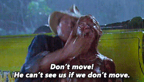

# Motion Pedestrian Detection

Motion Pedestrian Detection uses openCV to detect motion from a series of images and searches for pedestrians in the sections of images where motion is detected. This process saves on CPU performance making it better equipped to handle on smaller devices like the Raspberry PI.


Box Descriptions:

* yellow boxes - detected pedestrian
* green box - motion detected
* blue box - buffer area around the motion area that is scanned for a pedestrian. Set with motionPaddingCutoutPercent configuration.

Detection only occurs when movement is detect. If the pedestrian is not moving, detection does not occur. This is a reasonable trade off because any pedestrian worth tracking is moving.

In other words: It can't see you if you don't move.




## Requirements
* OpenCV
* Python 3
## Recommended
* FFMPEG
## Files Description
* `detect.py` - The main script used to detect pedestrians based off motion.
* `driver.py` - Demonstrates how to use `detect.py`. It starts an ffmpeg stream and sends images to `detect.py`. Possible to create your own driver based on this file.
* `driver.js` - Demonstrates how to use `detect.py` using Node. The node version of `driver.py`. It starts an ffmpeg process and sends images to a python process `detect-wrapper.py`, which then passes images to `detect.py`. Possible to create your own driver based on this file.
* `config.json` - Configuration file. Details below.

## Configuration Details
* pythonPath - Path to python executable. Needed if running Node driver.
* imshow - Displays the detection results in using openCV's imshow function. Useful for debugging. Turn off in production and command line only environments. 1 is on, 0 is off.
* writeOutput - Writes the detection results to file. One source of output that can be consumed by greater application that wraps around this project. 1 is on, 0 is off.
* writeTransparentOutput - A mostly transparent PNG with boxes containing the regions of interest. The PNG can be superimposed on the output stream. 1 is on, 0 is off.
* ip - The IP address of the the incoming RTSP stream.
* path - The path of the RTSP stream.
* detectFPS - The frames per second the detection will occur on the incoming stream
* width - The width of the resolution of the RTSP stream. If outputs looks garbled, this setting might be wrong.
* height - The height of the resolution of the RTSP stream. If outputs looks garbled, this setting might be wrong.
* minPixelSize - The minimum pixel size an object needs to be in order to detect motion. All objects smaller than this will be ignored. May need to adjust as height and width change.
* motionDeltaThreshold - The sensitivity of motion detection. Lower number results in more motion detection.
* motionPaddingCutoutPercent - Controls the size of the buffer area around the motion area that is scanned for a pedestrian. Is set as a percentage (e.g. .2 is 20%).
* cutOutHeightLimit - Limit on how short the padding area can be (blue box).
* checkNLargestObjects - Number of motion areas to perform motion detection on. Setting to 1 will only motion detection on the largest area. Setting to 2 will perform motion detect on the two largest areas, etc.
* windowStride - How quickly searching window parses an image. Lower number means high CPU intensive and more accurate. Higher number means less CPU intensive but less accurate. Min value of 1.
* hogPadding - The number of pixels in both the x and y direction in which the sliding window ROI is “padded” prior to HOG feature extraction. Typical values for padding include (8, 8), (16, 16), (24, 24), and (32, 32)
* hogScale - Controls the resize factor while process is repeatedly resizing image to find pedestrians. Smaller results in more resizes, more accurate and more CPU usage. Lower is less resizes, less accurate and less CPU usage. Minimum is 1.01.
* hogHitThreshold - hog variable in determining overlapping detection. Unless you know what you are doing, set to 0 and use overlapThresh
* overlapThresh - Used for non-maximum suppression, corrects for multiple detection of the same pedestrian. Amount of overlap per detection before counting it as a single detection.

## Examples
### Pedestrians:


Config settings:
```
"detectParameters": {
  "detectFps": 5,
  "width": 854,
  "height": 480,
  "minPixelSize": 5000,
  "motionDeltaThreshold": 2,
  "motionPaddingCutoutPercent": 0.2,
  "cutOutHeightLimit": 150,
  "checkNLargestObjects": 2,
  "windowStride": 4,
  "hogPadding": 4,
  "hogScale": 1.05,
  "hogHitThreshold": 0,
  "nonMaxSuppressionThreshold": 0.65
}
```

### Walk:


Config settings:
```
"detectParameters": {
  "detectFps": 5,
  "width": 854,
  "height": 480,
  "minPixelSize": 5000,
  "motionDeltaThreshold": 6,
  "motionPaddingCutoutPercent": 0.2,
  "cutOutHeightLimit": 150,
  "checkNLargestObjects": 1,
  "windowStride": 4,
  "hogPadding": 4,
  "hogScale": 1.05,
  "hogHitThreshold": 0,
  "nonMaxSuppressionThreshold": 0.65
}
```


### Running on Raspberry Pi 3:

Pi is able to handle both FFMPEG streaming and OpenCV motion detection and pedestrian detection.


Config settings:
```
"detectParameters": {
  "detectFps": 5,
  "width": 854,
  "height": 480,
  "minPixelSize": 5000,
  "motionDeltaThreshold": 6,
  "motionPaddingCutoutPercent": 0.2,
  "cutOutHeightLimit": 150,
  "checkNLargestObjects": 1,
  "windowStride": 4,
  "hogPadding": 4,
  "hogScale": 1.05,
  "hogHitThreshold": 0,
  "nonMaxSuppressionThreshold": 0.65
}
```


# blog posts inspiration

* https://www.pyimagesearch.com/2015/06/01/home-surveillance-and-motion-detection-with-the-raspberry-pi-python-and-opencv/
* https://www.pyimagesearch.com/2015/05/25/basic-motion-detection-and-tracking-with-python-and-opencv/
* https://www.pyimagesearch.com/2014/11/17/non-maximum-suppression-object-detection-python/
* https://www.pyimagesearch.com/2015/11/09/pedestrian-detection-opencv/